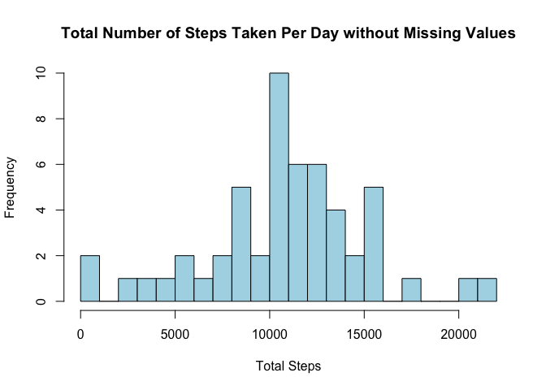
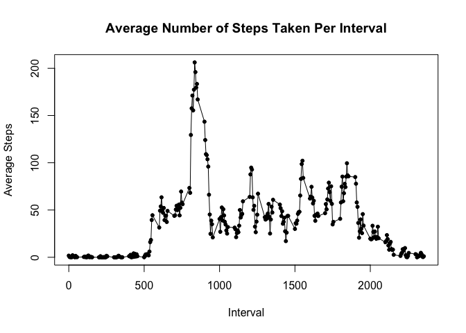
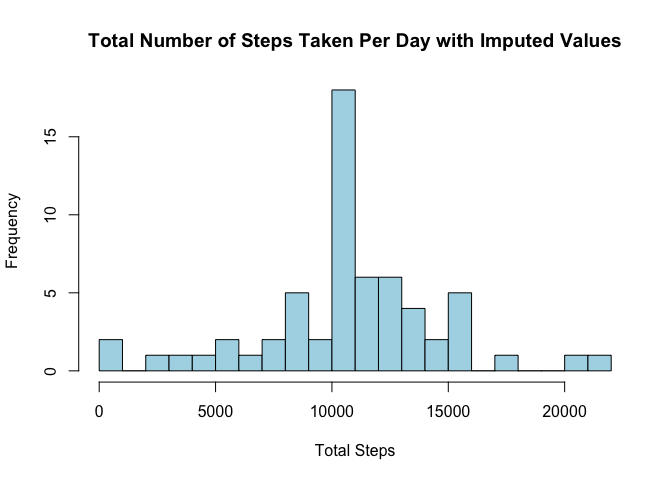
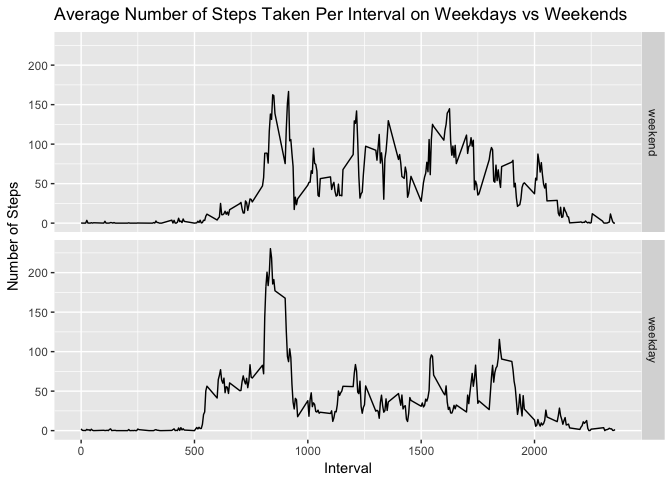

```r
library(knitr)
library(ggplot2)

opts_chunk$set(echo = TRUE, results = "hide", warning=FALSE, message=FALSE, fig.path = "./figure/", fig.show = "asis", dev = "png")
options(scipen = 999, digits = 2)
```


## Loading and preprocessing the data

```r
zipPath <- "./activity.zip"
filePath <- "./activity.csv"
if(!file.exists(filePath)) {
        unzip(zipPath)
}
if(!file.exists("./figure")){
        dir.create("./figure")
}
        

data <- read.csv(filePath, 
                 header = TRUE)
data$date <- as.Date(data$date, "%Y-%m-%d")
completeData <- data[complete.cases(data), ]
```


## What is mean total number of steps taken per day?

```r
## Calculate total steps taken per day
totalStepsPerDay <- aggregate(steps ~ date, data = completeData, sum)

## Plot histogram of total steps taken per day
hist(totalStepsPerDay$steps,
     col = "lightblue",
     breaks = 20,
     xlab = "Total Steps",
     ylab = "Frequency",
     main = "Total Number of Steps Taken Per Day without Missing Values")
```

<!-- -->

```r
## Calculate mean and median of total steps taken per day
meanStepsPerDay <- mean(totalStepsPerDay$steps)  
medianStepsPerDay <- median(totalStepsPerDay$steps)
```

Mean number of steps taken per day: 10766.19  

Median number of steps taken per day: 10765

## What is the average daily activity pattern?

```r
## Calculate mean steps taken per interval
meanStepsPerInterval <- aggregate(steps ~ interval, data = completeData, mean)

## Plot time series graph of average steps taken per interval
plot(meanStepsPerInterval$interval, meanStepsPerInterval$steps, pch = 20,
     xlab = "Interval",
     ylab = "Average Steps",
     main = "Average Number of Steps Taken Per Interval")
lines(meanStepsPerInterval$interval, meanStepsPerInterval$steps, type = "l")
```

<!-- -->

```r
intervalWithMostSteps <- meanStepsPerInterval[which.max(meanStepsPerInterval$steps), 1]
```

Interval with the maximum number of steps, on average across all the days: 835

## Imputing missing values

```r
numMissingValues <- sum(is.na(data$steps))

## Impute missing values with average (mean) steps per interval
## As a result, the average steps per interval stays the same, but the total steps taken per day has increased
missingData <- data[is.na(data$steps), ]
imputedData <- data
missingData$steps <- meanStepsPerInterval$steps[match(meanStepsPerInterval$interval, missingData$interval)]
imputedData[is.na(data$steps),] <- missingData

## Calculate total steps taken per day
imputedTotalStepsPerDay <- aggregate(steps ~ date, data = imputedData, sum)

## Plot histogram of total steps taken per day
hist(imputedTotalStepsPerDay$steps,
     col = "lightblue",
     breaks = 20,
     xlab = "Total Steps",
     ylab = "Frequency",
     main = "Total Number of Steps Taken Per Day with Imputed Values")
```

<!-- -->

```r
## Calculate mean and median of total steps taken per day
imputedMeanStepsPerDay <- mean(imputedTotalStepsPerDay$steps)  
imputedMedianStepsPerDay <- median(imputedTotalStepsPerDay$steps)

totalSteps <- sum(totalStepsPerDay$steps)
imputedTotalSteps <- sum(imputedTotalStepsPerDay$steps)
```

Number of missing values in the dataset: 2304

Imputed mean number of steps taken per day: 10766.19  

Imputed median number of steps taken per day: 10766.19

Total number of steps in the original dataset: 570608

Total number of steps in the imputed dataset: 656737.51

By imputing missing data with the mean number of steps per interval, we are able to maintain the same mean number of steps per day. The median has changed to match the mean. The grand total number of steps taken in the study has increased by 86129.51.

## Are there differences in activity patterns between weekdays and weekends?


```r
## Create factor variable for weekdays and weekends
weekends <- c("Saturday", "Sunday")
imputedData$dayType <- factor(weekdays(imputedData$date) %in% weekends, levels = c(TRUE, FALSE), labels=c("weekend", "weekday"))

## Calculate mean steps per interval for weekdays and weekends
imputedMeanStepsPerInterval <- aggregate(steps ~ interval+dayType, data = imputedData, mean)

## Plot time series graph of mean steps taken per interval on weekdays vs weekends
g <- ggplot(imputedMeanStepsPerInterval, aes(x = interval, y = steps))
g + geom_line() + 
    facet_grid(dayType ~ .) + 
    labs(x = "Interval", y = "Number of Steps", 
    title = "Average Number of Steps Taken Per Interval on Weekdays vs Weekends")
```

<!-- -->

It appears the individual takes more steps throughout the day on weekends, but takes the most steps during the morning on weekdays.


